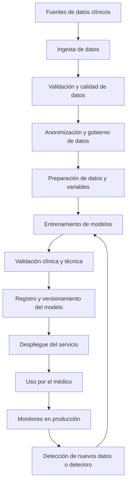

# Propuesta de pipeline MLOps para predicción de enfermedad común y enfermedad huérfana

## 1. Contexto del problema

En medicina existe una gran cantidad de información clínica disponible en historias clínicas electrónicas, laboratorios, imágenes, medicamentos, antecedentes y notas médicas. Sin embargo, no todas las enfermedades tienen la misma disponibilidad de datos. Las enfermedades comunes suelen tener muchos registros, mientras que las enfermedades huérfanas tienen pocos casos disponibles.

El objetivo es construir una solución de machine learning capaz de recibir datos de síntomas de un paciente y estimar si podría presentar alguna condición compatible con enfermedad. La solución debe funcionar tanto en enfermedades comunes, donde hay suficientes datos para entrenar modelos convencionales, como en enfermedades huérfanas, donde se requieren estrategias especiales para trabajar con pocos datos.

### Caso de uso específico: drepanocitosis (anemia falciforme)

Como caso de uso concreto para ilustrar el pipeline, se toma la drepanocitosis. Esta es una enfermedad huérfana de origen genético que afecta los glóbulos rojos, causando episodios de crisis vaso-oclusivas dolorosas y complicaciones graves como el síndrome torácico agudo (STA). En Colombia tiene una prevalencia real en comunidades afrodescendientes del Pacífico y el Caribe, aunque sigue siendo poco frecuente a nivel general.

El modelo busca clasificar la severidad de una posible crisis drepanocítica a partir de parámetros clínicos objetivos: saturación de oxígeno (SpO₂), escala de dolor, hemoglobina, temperatura, frecuencia respiratoria y antecedente de crisis previas. La clasificación resultante orienta al médico sobre el nivel de atención requerido.

## 2. Diagrama general del pipeline MLOps

## 3. Etapas del pipeline

### 3.1 Diseño del problema

La primera etapa consiste en definir con claridad qué se quiere predecir. En este caso, el sistema no debe reemplazar al médico, sino apoyar la sospecha clínica a partir de síntomas y datos básicos del paciente.

Las restricciones principales son:

- Los datos clínicos pueden estar incompletos, mal escritos o registrados en formatos diferentes.
- Los síntomas pueden aparecer como texto libre en la historia clínica.
- Las enfermedades comunes tienen muchos datos, pero las enfermedades huérfanas tienen pocos casos.
- Existe riesgo de sesgo si el modelo aprende más de las enfermedades frecuentes y falla en las raras.
- Se debe proteger la confidencialidad de los pacientes.
- El resultado debe ser interpretable para el médico.

Los tipos de datos posibles incluyen:

- Síntomas escritos en texto libre.
- Edad, sexo y antecedentes.
- Signos vitales.
- Resultados de laboratorio.
- Diagnósticos previos codificados en CIE-10.
- Medicamentos formulados.
- Evoluciones médicas.

### 3.2 Ingesta y manejo de datos

Los datos pueden provenir de varias fuentes:

- Historia clínica electrónica.
- Bases de datos hospitalarias.
- Registros de laboratorio.
- Registros de imágenes diagnósticas.
- Bases externas o literatura médica para enfermedades huérfanas.
- Registros nacionales o internacionales, si están disponibles.

Antes de entrenar cualquier modelo, los datos deben pasar por procesos de limpieza, normalización y anonimización. Esto incluye eliminar identificadores personales, corregir formatos, unificar nombres de variables, transformar texto clínico en variables útiles y revisar valores faltantes o extremos.

### 3.3 Preparación de variables

Para enfermedades comunes, se pueden crear variables tradicionales como presencia o ausencia de síntomas, edad, signos vitales alterados, laboratorios anormales y antecedentes.

Para enfermedades huérfanas, como hay pocos datos, se deben usar estrategias adicionales:

- Agrupar síntomas por categorías clínicas.
- Usar conocimiento médico experto para definir reglas iniciales.
- Aprovechar modelos preentrenados de lenguaje clínico para interpretar texto libre.
- Usar aprendizaje por transferencia.
- Usar métodos de few-shot learning o modelos que puedan aprender con pocos ejemplos.
- Complementar con revisión médica experta.

### 3.4 Desarrollo del modelo

Se pueden usar diferentes enfoques según la cantidad y calidad de datos.

Para enfermedades comunes:

- Regresión logística.
- Random Forest.
- XGBoost.
- Redes neuronales.
- Modelos de lenguaje para interpretar síntomas en texto libre.

Para enfermedades huérfanas:

- Modelos basados en similitud entre pacientes.
- Modelos de clasificación con aprendizaje por transferencia.
- Few-shot learning.
- Sistemas híbridos que combinen reglas clínicas y machine learning.
- Modelos que devuelvan probabilidad o nivel de sospecha, no diagnóstico definitivo.

El resultado esperado debería expresarse como una categoría de riesgo o sospecha, por ejemplo: sin sospecha, sospecha leve, sospecha alta o enfermedad crónica probable. También debe mostrar qué variables influyeron en la predicción.

### 3.5 Validación y pruebas

La validación debe ser técnica y clínica.

Validación técnica:

- Separar datos en entrenamiento, validación y prueba.
- Medir sensibilidad, especificidad, precisión, F1-score y área bajo la curva.
- Evaluar calibración del modelo.
- Revisar desempeño por subgrupos: edad, sexo, comorbilidades o tipo de enfermedad.

Validación clínica:

- Revisión por médicos expertos.
- Análisis de falsos negativos, especialmente en enfermedades huérfanas.
- Evaluación de explicabilidad.
- Pruebas con casos clínicos simulados.

En enfermedades huérfanas debe darse mayor importancia a la sensibilidad, porque perder un caso raro puede tener consecuencias clínicas importantes.

### 3.6 Registro y versionamiento

Cada modelo entrenado debe quedar registrado con:

- Versión del modelo.
- Fecha de entrenamiento.
- Datos usados.
- Variables usadas.
- Métricas de desempeño.
- Limitaciones conocidas.
- Responsable de aprobación.

Esto permite trazabilidad y facilita saber qué versión del modelo produjo una predicción específica.

### 3.7 Producción y despliegue

El modelo puede desplegarse como un servicio web o API. El médico ingresaría los síntomas y datos clínicos básicos, y el sistema retornaría una categoría de riesgo o sospecha.

La solución podría tener:

- Un formulario web simple.
- Un endpoint de API para integrarse con historia clínica.
- Un contenedor Docker para facilitar despliegue local o institucional.
- Logs de uso y predicciones.

En producción, el sistema debe ser seguro, estable y fácil de usar. No debe entregar diagnósticos cerrados, sino apoyo a la decisión clínica.

### 3.8 Monitoreo

El monitoreo es una parte central de MLOps. No basta con entrenar y desplegar el modelo; se debe vigilar su comportamiento en el tiempo.

Se debe monitorear:

- Número de predicciones realizadas.
- Distribución de síntomas ingresados.
- Cambios en los datos de entrada.
- Desempeño del modelo cuando se conozca el diagnóstico final.
- Frecuencia de falsos negativos y falsos positivos.
- Errores del servicio.
- Tiempo de respuesta.
- Posibles sesgos por población.

Si los datos cambian o el desempeño baja, se debe activar un proceso de reentrenamiento.

### 3.9 Reentrenamiento

Con el tiempo aparecerán nuevos datos, nuevos diagnósticos confirmados y nuevos patrones clínicos. Estos datos deben alimentar nuevamente el pipeline.

El reentrenamiento puede hacerse:

- De forma periódica, por ejemplo cada 3 o 6 meses.
- Cuando se detecte deterioro del desempeño.
- Cuando aparezcan nuevas enfermedades o nuevos criterios clínicos.
- Cuando se acumulen suficientes casos nuevos de enfermedades huérfanas.

Antes de reemplazar el modelo anterior, el nuevo modelo debe ser validado y aprobado.

## 4. Consideraciones éticas y de seguridad

La solución debe proteger los datos personales de los pacientes. También debe evitar que el médico interprete el resultado como diagnóstico definitivo.

El modelo debe mostrar advertencias claras:

- Es una herramienta de apoyo, no reemplaza el juicio clínico.
- Los resultados deben interpretarse en contexto.
- Los casos de alta sospecha deben ser evaluados por personal médico.
- En enfermedades huérfanas, el modelo puede ayudar a sospechar, pero no confirmar la enfermedad.

## 5. Conclusión

El pipeline propuesto permite organizar el ciclo completo de una solución de machine learning en salud: desde la definición del problema y la preparación de datos, hasta el despliegue, monitoreo y reentrenamiento. En este caso, MLOps es importante porque permite que el modelo no sea solo un experimento académico, sino una solución controlada, trazable, segura y actualizable en el tiempo.
